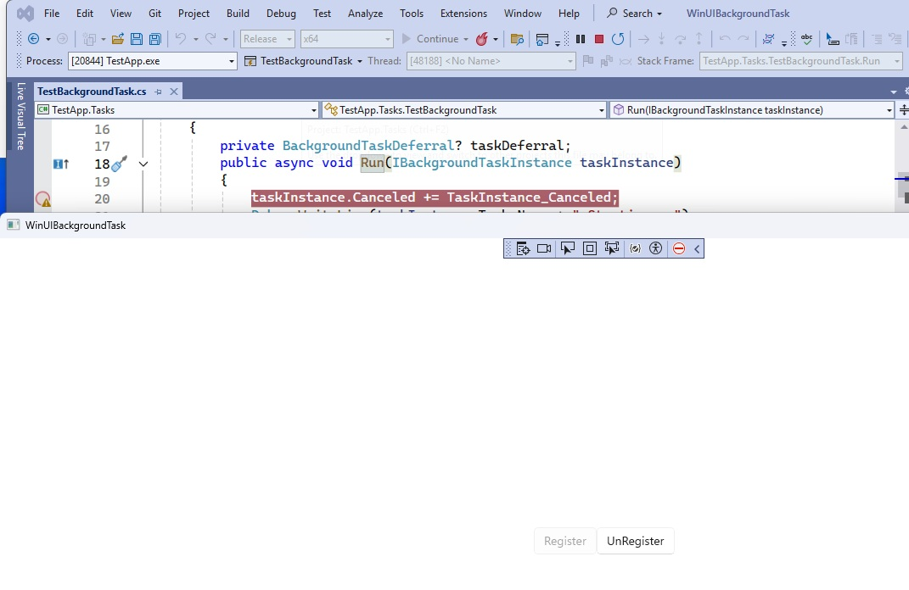
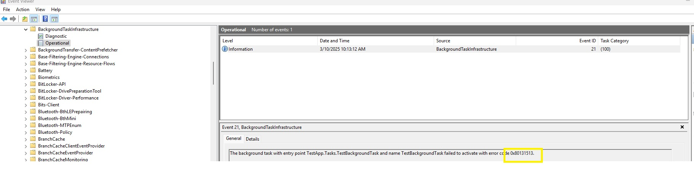
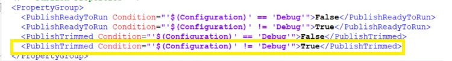
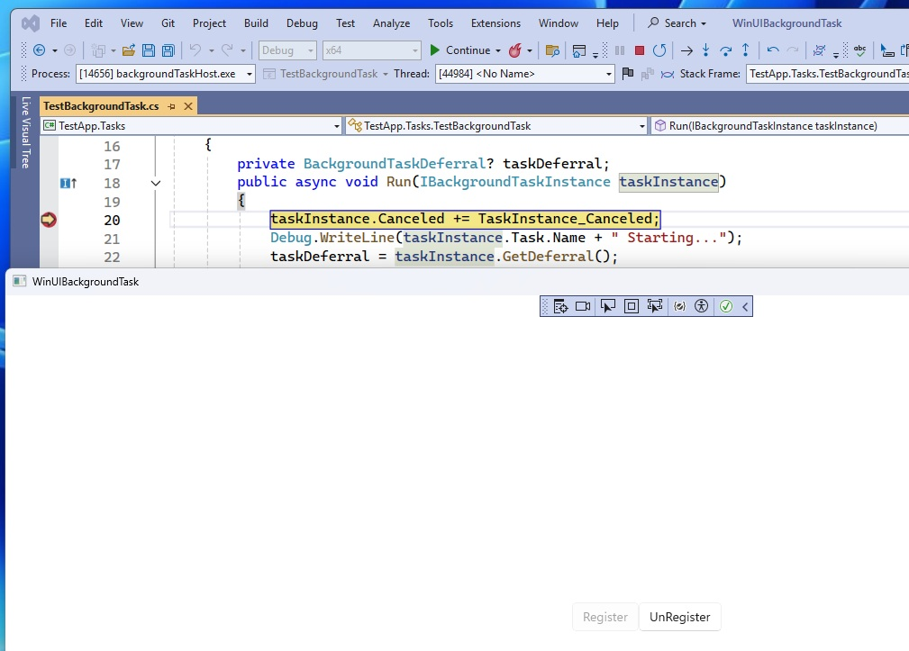

# Issue:

Background task could not trigger in release build with PublishTrimmed enabled by default.

https://github.com/microsoft/CsWinRT/issues/1946

# How to test:

1. Pull the code and set breakpoint in TestBackgroundTask::Run
2. Change the build config to Release/X64
3. Start Debugging to launch the UI
4. Click Register button and switch back to VS to trigger the background task.

**Release: notworking**
>>

**Event Log:**
>>

**Release Config:**
>>

**Debug: working**
>>

